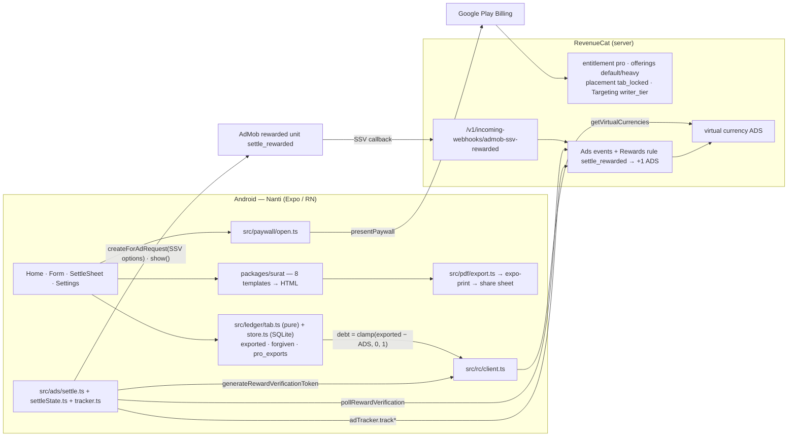

# Architecture

Derived from the code as it is (2026-09-16). Modules named here exist; SDK calls named here are greppable.

## Stack (`package.json`)

| Layer                                                | Package                                                                                           | Version                                                                                                                                                                                                             |
| ---------------------------------------------------- | ------------------------------------------------------------------------------------------------- | ------------------------------------------------------------------------------------------------------------------------------------------------------------------------------------------------------------------- |
| App                                                  | `expo` / `react-native` / `react`                                                                 | ~54.0 / 0.81.5 / 19.1 — SDK 54 because `react-native-google-mobile-ads@16.5` uses RN 0.80+ codegen types; `plugins/withKotlinMetadataCheck.js` lets Kotlin 2.1 link the Kotlin-2.3-built `play-services-ads:25.4.0` |
| Purchases · ad tracking · rewards · virtual currency | `react-native-purchases`                                                                          | 10.9.1                                                                                                                                                                                                              |
| Paywall                                              | `react-native-purchases-ui`                                                                       | 10.9.1                                                                                                                                                                                                              |
| Ads (rewarded, SSV, UMP consent)                     | `react-native-google-mobile-ads`                                                                  | 16.5.0                                                                                                                                                                                                              |
| PDF · share · file name                              | `expo-print` · `expo-sharing` · `expo-file-system` (SDK 54 `File`/`Paths` API)                    | Expo-managed                                                                                                                                                                                                        |
| Live preview                                         | `react-native-webview`                                                                            | 13.15                                                                                                                                                                                                               |
| Local state                                          | `expo-sqlite`                                                                                     | 16.0                                                                                                                                                                                                                |
| Locale · fonts · haptics · uuid                      | `expo-localization` · `@expo-google-fonts/{inter,space-grotesk}` · `expo-haptics` · `expo-crypto` | Expo-managed                                                                                                                                                                                                        |
| Tests / scripts                                      | `vitest` · `tsx`                                                                                  | 4.x                                                                                                                                                                                                                 |
| Backend                                              | **none** — RevenueCat + AdMob SSV do the only server-side work                                    | —                                                                                                                                                                                                                   |

## System



## The settle sequence (`src/ads/settle.ts`)

```
tap "Tonton 1 iklan"
  impressionId = randomUUID()
  token = Purchases.generateRewardVerificationToken(impressionId)
  ad = RewardedAd.createForAdRequest(unit, { serverSideVerificationOptions: { userId: token.appUserID, customData: token.customData } })
  LOADED        → adTracker.trackAdLoaded  → ad.show()
  OPENED        → trackAdDisplayed, trackAdOpened
  PAID          → trackAdRevenue({ revenueMicros, currency, precision })
  ERROR         → trackAdFailedToLoad → state no_fill          (tab unchanged; "Lanjut dulu" offered)
  CLOSED (no reward) → state closed_early                       (tab unchanged)
  EARNED_REWARD (t0) → state verifying
      result = Purchases.pollRewardVerification(token.clientTransactionId, { adMob, rewarded, unit, impressionId, placement })  (t1)
      failed || reward.type ≠ virtual_currency → state failed   (tab unchanged; NOTHING else happens)
      else balance = getVirtualCurrencies().all.ADS.balance     (t2) → state settled → pill clears from this read
  settle_log ← { impressionId, t0, t1, t2, balanceBefore, balanceAfter, outcome }
```

## Modules

| Path                                 | Responsibility                                                                                                                                                                                              |
| ------------------------------------ | ----------------------------------------------------------------------------------------------------------------------------------------------------------------------------------------------------------- |
| `packages/surat/templates/*.ts`      | eight `Template`s: id, title, subtitle, glyph, five `Field`s, `render(values, ctx) → html`                                                                                                                  |
| `packages/surat/format.ts`           | `formatTanggal` · `formatHariTanggal` · `formatRentang` · `escapeHtml` · `v` (dotted blank) · `daftar` · `jumlahBerkas`                                                                                     |
| `packages/surat/html.ts`             | the A4 paper stylesheet + `meta`, `kepada`, `ttd`, `ttd2` helpers                                                                                                                                           |
| `packages/surat/index.ts`            | registry, `render`, `isComplete`, `clampValues`, `pdfFileName`                                                                                                                                              |
| `bin/surat.ts`                       | CLI: list · render · demo                                                                                                                                                                                   |
| `src/ledger/tab.ts`                  | `debt`, `reduce` (the export table), `writerTier`, `lettersMade` — pure                                                                                                                                     |
| `src/ledger/store.ts`                | SQLite: `ledger` row, `settle_log`, prefs                                                                                                                                                                   |
| `src/ads/settleState.ts`             | idle → loading → playing → verifying → settled / failed / no_fill / closed_early                                                                                                                            |
| `src/ads/settle.ts`                  | the round-trip above; `rewardedUnitId()` = Google's test unit in dev builds, the real `settle_rewarded` unit in release; a token/request failure ends in `no_fill`                                          |
| `src/ads/init.ts`                    | memoised UMP consent → `mobileAds().initialize()`; started by `App.tsx`, awaited by `settle.ts` before any ad request                                                                                       |
| `src/ads/tracker.ts`                 | `Purchases.adTracker.*` adapters keyed by impressionId, placement `tab_settle_rewarded`                                                                                                                     |
| `src/rc/client.ts`                   | `configure` · `getCustomerInfo` + listener · `getVirtualCurrencies` · `invalidateVirtualCurrenciesCache` · `restorePurchases` · `setAttributes` + `syncAttributesAndOfferingsIfNeeded` · `getAppUserID`     |
| `src/paywall/open.ts`                | `getCurrentOfferingForPlacement('tab_locked')` → `RevenueCatUI.presentPaywall`; no offering → `unavailable`, shown as a message on the sheet                                                                |
| `src/pdf/export.ts`                  | `printToFileAsync` → move to `Surat-<id>-<name>-<date>.pdf` → `shareAsync`                                                                                                                                  |
| `src/i18n/`                          | `id`, `en`, `resolveLocale`, key-parity tested                                                                                                                                                              |
| `src/state/AppContext.tsx`           | ledger, prefs, live CustomerInfo, ADS balance (server read), derived `debt`, `recordExport`                                                                                                                 |
| `src/screens/`                       | Home (tiles + `TabPill`) · Form (fields + `LivePreview`) · SettleSheet · Settings (receipt panel)                                                                                                           |
| `scripts/`                           | `bench.ts` · `verify_offline.ts` · `ablation.js` · `settle-log-export.ts` · `check_submission_readiness.js` · `bundle-check.js` · `gen-golden.ts`                                                           |
| `plugins/withReleaseSigning.js`      | release signing from `NANTI_KEYSTORE_*` env (keystore in `~/.config/nanti/`)                                                                                                                                |
| `plugins/withKotlinMetadataCheck.js` | adds `-Xskip-metadata-version-check` to every Kotlin compile task — the only way `play-services-ads:25.4.0` (Kotlin 2.3) links under Expo 54 (Kotlin 2.1); its header documents the two failed alternatives |
| `app.config.ts`                      | Expo config; `react-native-google-mobile-ads` plugin with `NANTI_ADMOB_APP_ID` (sample id fallback)                                                                                                         |

## Data

SQLite `nanti.db` — `ledger` (one row: `exported`, `forgiven`, `pro_exports`, `last_ads_seen`, `last_city`, `locale`)
and `settle_log` (`impression_id`, `t_earned`, `t_verified`, `t_balance`, `balance_before`, `balance_after`,
`outcome`). **Derived, never stored:** `debt`, `isPro`. See `docs/LEDGER.md`.

## Deliberate refusals

`purchasePackage` is not called directly (the paywall owns it) · no `logIn` (anonymous ids) · no Customer Center
(Pro-plan feature; Settings has restore) · no REST calls from the client (no secret key ships) · no interstitials,
no banner, never more than one ad per letter, never an ad before the PDF.
