<div align="center">


# Nanti

**Suratnya sekarang, iklannya nanti.** — _The letter now. The ad later._



[The flow](#-the-one-flow) · [Why the tab cannot lie](#-why-the-tab-cannot-lie) · [RevenueCat integration](#-revenuecat-is-the-engine) · [Run it](#-run-it-without-credentials)

     

</div>

---

## ✉️ What it is

Indonesian workers, students and parents regularly need a _correctly formatted_ formal letter — surat izin, surat kuasa, surat pernyataan, lamaran, pengunduran diri — on the phone, right now, to send over chat. Every "surat izin" app puts a 30-second ad **between you and the PDF**.

Nanti flips the order. Pick one of eight letters, fill five fields (city and date are auto-filled), tap **Buat PDF** — and the share sheet opens with a properly structured A4 letter. _Then_ one rewarded ad goes on a visible tab: **`Tab: 1 iklan · bayar nanti`**. Settle it whenever you like by watching one ad — or never, with Nanti Pro. The tab is capped at one, and it is cleared by **RevenueCat's server**, not by the app's opinion.

> Built for the Shipaton 2026 **Catvertising Award**: _"the most creative and effective use of ads as a monetization method — clever placements, smart integration with the rest of the revenue stack, and an experience users don't hate."_

## ⚡ The one flow

```
Home (8 tiles + tab pill)
  → Form (5 fields, live paper preview)
  → "Buat PDF" → expo-print → share sheet            ← value delivered FIRST
  → Home: pill "Tab: 1 iklan · bayar nanti"
  → [next letter while the tab is open] → Settle sheet:
        "Tonton 1 iklan"  → rewarded ad → AdMob SSV → RevenueCat verifies → ADS +1 → tab clears (green, once)
        "Nanti Pro"       → RevenueCat paywall @ placement tab_locked → Pro → tab gone for good
        [no ad can be served] → "Lanjut dulu" — the letter is delivered anyway; the tab stays at 1, never 2
```

Stated precisely, because the app is held to it: **you never pay before a letter; every letter is delivered before its own ad; the one ad you owe is settled before the next free letter** — or never (Pro), or waived (no fill).

```bash
$ npx tsx bin/surat.ts demo 1      # the first demo letter, as the exact HTML the PDF is printed from
```

## 🔒 Why the tab cannot lie

`debt = clamp(exported − ADS, 0, 1)`. `exported` is a local count of letters delivered. **`ADS` is a RevenueCat virtual currency the app only reads.** The only way `debt` goes from 1 to 0 is a fresh `getVirtualCurrencies()` read after `Purchases.pollRewardVerification` resolved with a `virtual_currency` reward — which RevenueCat grants server-side after AdMob's server-side verification callback.

- `npm run ablation` greps `src/` for any client-side settle increment and must print **0**.
- The settle state machine (`src/ads/settleState.ts`) cannot reach `settled` without a `verified` event; the tests walk every event sequence up to length 4 to prove it.
- The ledger's four invariants hold under a 5,000-step random walk (`tests/ledger.test.ts`) and 20,000 steps in `npm run verify:offline`.

Full table and invariants: [docs/LEDGER.md](docs/LEDGER.md).

## 💳 RevenueCat is the engine

Delete RevenueCat and there is no verified ledger of settled ads → the tab can never be paid → the second letter locks forever, and there is no Pro to clear it. Fifteen SDK methods across three files:

| Where                               | Call                                                                                                                                         | Why                                                                                  |
| ----------------------------------- | -------------------------------------------------------------------------------------------------------------------------------------------- | ------------------------------------------------------------------------------------ |
| Launch (`src/rc/client.ts`)         | `Purchases.configure`                                                                                                                        | anonymous customer, no accounts                                                      |
| The tab                             | `getVirtualCurrencies()` · `invalidateVirtualCurrenciesCache()`                                                                              | the ADS balance — read, never written                                                |
| Settle (`src/ads/settle.ts`)        | `generateRewardVerificationToken(impressionId)` → SSV options on the AdMob request → `pollRewardVerification(clientTransactionId, metadata)` | the verified grant; `failed` → nothing happens                                       |
| Ad lifecycle (`src/ads/tracker.ts`) | `adTracker.trackAdLoaded` · `trackAdDisplayed` · `trackAdOpened` · `trackAdRevenue` · `trackAdFailedToLoad`                                  | impression-level revenue next to subscription revenue in one LTV                     |
| Pro (`src/paywall/open.ts`)         | `getCurrentOfferingForPlacement('tab_locked')` → `RevenueCatUI.presentPaywall`                                                               | `purchasePackage` runs inside the paywall — one purchase path                        |
| Gate                                | `getCustomerInfo()` + `addCustomerInfoUpdateListener`                                                                                        | `entitlements.active.pro` hides the tab and skips the ledger                         |
| Settings                            | `restorePurchases()`                                                                                                                         | judge / reinstall path                                                               |
| After every export                  | `setAttributes({ letters_made, writer_tier })` + `syncAttributesAndOfferingsIfNeeded()`                                                      | Targeting: `writer_tier = heavy` → offering `heavy` (lifetime first) at `tab_locked` |

Dashboard objects: entitlement `pro` · products `nanti_pro_monthly` (7-day free trial — the judge path) + `nanti_pro_lifetime` · offerings `default` / `heavy` · placement `tab_locked` · virtual currency `ADS` · Rewards rule `settle_rewarded → ADS × 1` · AdMob OAuth connection.

## 🧪 Run it without credentials

```bash
npm install --legacy-peer-deps
npm test                    # 55 tests: 8 golden templates, ledger invariants, settle state machine, i18n parity, formatting
npm run bench               # each template rendered 1,000× — p50/p95 per template + ledger throughput; fails on golden drift
npm run verify:offline      # the offline-capable parts, no network
npm run ablation            # 0 client-side settle increments in src/
npx tsx bin/surat.ts list   # the eight templates and their fields
```

### Run the app (dev build, Android)

```bash
cp .env.example .env         # RevenueCat Test Store key; the real settle_rewarded unit id; AdMob app id
npx expo prebuild --platform android
npx expo run:android         # physical device; RevenueCat + AdMob need a dev build, not Expo Go
```

Without the real ad unit, Google's sample unit serves test creatives but **server-side verification cannot be enabled on it**, so every settle correctly comes back `failed` and the tab stays — the app never pretends otherwise. The first-run protocol and pass criteria are in [docs/SPIKE.md](docs/SPIKE.md).

## 📦 Repository

```
packages/surat/     8 templates → HTML (pure TS) · format.ts (Indonesian dates) · html.ts (A4 paper)
bin/surat.ts        CLI over the same package: list · render · demo
src/ledger/         tab.ts (the state machine) · store.ts (SQLite)
src/ads/            settle.ts (token → ad → poll → balance) · settleState.ts · tracker.ts
src/rc/ src/paywall/  client.ts · open.ts
src/pdf/            export.ts (expo-print → real file name → share sheet)
src/i18n/           id · en (chrome only — letters are always Indonesian)
src/screens/        Home · Form (live preview) · SettleSheet · Settings (RevenueCat receipt)
scripts/            bench · verify_offline · ablation · settle-log-export · check_submission_readiness · bundle-check
tests/              55 tests + golden/ (8 HTML files)
docs/               LEDGER.md · SPIKE.md · DX-REPORT.md · assets/
site/               landing + privacy policy (GitHub Pages)
```

[ARCHITECTURE.md](ARCHITECTURE.md) is derived from the code · [DEMO.md](DEMO.md) has the judge path, receipts, and what is unfinished.

## 📄 License

MIT — see [LICENSE](LICENSE).
